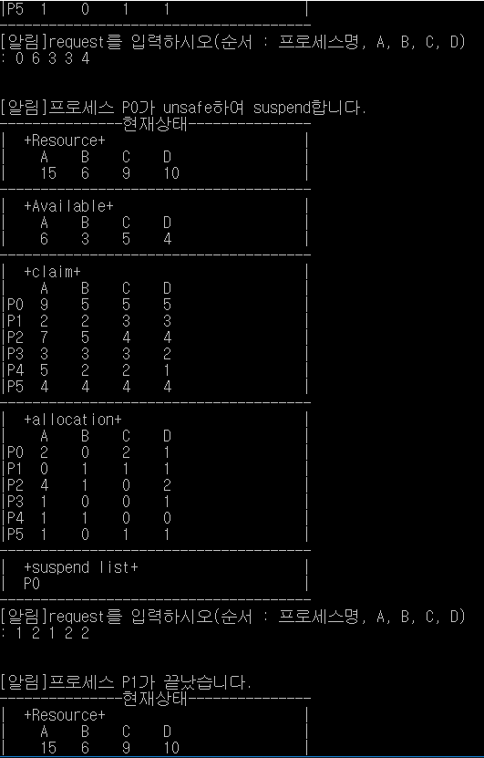

# Banker
#### An implementation of Banker's Algorithm in C  
  
### Description  
This is an implementation of Banker's Algorithm for Deadlock Avoidance in C. A status of example processes is predefined in the source.
As executing the program, you can see the _Resource_, _Available_, _claim_, _allocation_, and notification in Koeran.  
&nbsp;  
_Resource_ is a list of resources to allocate and the total number of them.  
_Available_ is the number of currently available resources.  
_claim_ shows the number of resources to finish the process.  
_allocation_ shows the number of currently allocated resources at each process.  
&nbsp;  
If you allocate the resources _unsafely_, the process is suspended. The program is terminated when all processes complete.  
  
### Usage  
The command to allocate resources is ordered by (Process #, amount to allocate of resource A, resource B, resource C).  
Type this command:  
```>> 0 1 2 3 4```  
means allocate 1 of resource A, 2 of resource B, 3 of resource C, and 4 of resource D to P0.  
&nbsp;  

